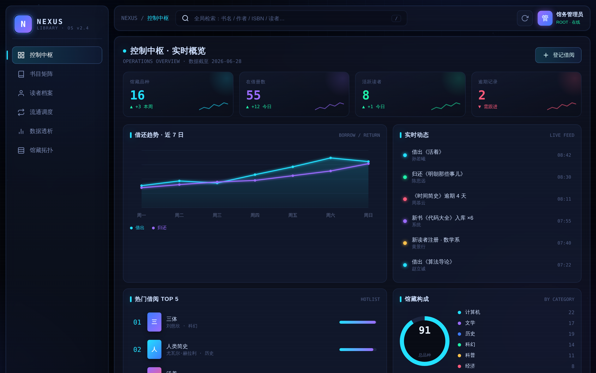

# NEXUS · 图书馆数字管理系统

一个**纯前端、零依赖、离线可用**的图书馆数字管理系统，深色科技感（cyber / HUD 风格）UI。
双击 `index.html` 即可在浏览器运行，无需安装、无需后端、无需联网。



## 特性

**科技感 UI**
- 开机自检动画（进度条 + 滚动日志）、双层旋转能量环
- Canvas 粒子星链背景 + 动态网格 + 流光扫描线 + 霓虹辉光
- 玻璃拟态（glassmorphism）面板、霓虹描边、悬停发光
- 实时系统状态表（核心负载 / 检索引擎 / 同步链路）+ 实时时钟
- **命令面板（`Ctrl/⌘ + K`）**：键盘驱动，快速跳转视图、执行操作、检索书目与读者
- 书目矩阵支持**表格 / 画廊**双视图切换；表头点击排序带方向箭头
- **通知中心**：顶栏铃铛带角标，汇总逾期 / 借罄 / 低库存告警，支持一键催还
- **数据导出 / 备份**：书目与流通记录导出 CSV（含 UTF-8 BOM），全量 JSON 备份与恢复
- **读者借阅画像**：读者详情内置 Canvas 雷达图，按分类可视化借阅偏好
- **强调色主题切换**：极光蓝 / 品红 / 翡翠 / 琥珀四套配色，图表同步换色并持久化
- **移动端响应式**：窄屏自动切换为底部标签栏导航，顶栏与栅格自适应重排

**六大功能视图**
| 视图 | 说明 |
| --- | --- |
| 控制中枢 | KPI 卡片、借还趋势折线图、实时动态流、热门 TOP5、馆藏构成圆环 |
| 书目矩阵 | 书目表格，分类筛选 / 关键词搜索 / 点击表头排序 |
| 读者档案 | 读者列表、会员等级分布、信用分、借阅记录 |
| 流通调度 | 借阅单据、状态（在借 / 逾期 / 已还）、一键办理归还 |
| 数据透析 | 分类藏量条形图、馆藏健康度圆环、周转率分析 |
| 馆藏拓扑 | 6 分区占用热力网格，实时容量可视化 |

**完整业务逻辑（CRUD）**
- 新增 / 编辑 / 下架书目（库存联动）
- 注册读者（按等级自动配额）
- 登记借阅（校验库存与读者配额）、办理归还（库存与在借数回滚）
- 全局检索（书名 / 作者 / ISBN / 读者，按 `/` 聚焦）
- 数据用 `localStorage` 持久化；顶栏按钮可一键重置演示数据

## 运行

```bash
# 方式一：直接打开
open library-system/index.html        # macOS
# 或在文件管理器里双击 index.html

# 方式二：本地静态服务（推荐，避免个别浏览器 file:// 限制）
cd library-system && python3 -m http.server 8080
# 浏览器访问 http://localhost:8080
```

## Windows：安装到 D 盘 + 桌面快捷方式

仓库自带安装脚本，把本系统装到 `D:\NexusLibrary` 并在桌面生成快捷方式。

1. 下载/克隆本仓库到 Windows（任意位置）：
   ```powershell
   git clone https://github.com/Gghubethan/turbo-barnacle.git
   ```
   不想用 git 的话，到 GitHub 仓库页 **Code → Download ZIP**，解压即可。
2. 进入 `turbo-barnacle\library-system` 文件夹。
3. **双击 `安装到D盘.bat`**（它会绕过执行策略调用 `install-windows.ps1`）。
4. 完成后，双击桌面 **「图书馆管理系统」** 即可用默认浏览器打开。

> - 想装到别的盘/目录：用记事本打开 `install-windows.ps1`，改第一行的 `$dest` 即可。
> - 不想安装、只想临时打开：直接双击 `打开图书馆系统.bat` 或 `index.html`。
> - 纯本地静态文件，离线可用，数据存浏览器 `localStorage`。

## 文件结构

```
library-system/
├── index.html   # 结构 + 开机/背景层
├── styles.css   # 全部样式（主题变量、动画、组件、内联 SVG 图标）
├── data.js      # 演示数据（书目 / 读者 / 流通 / 趋势 / 分区）
└── app.js       # 应用逻辑（路由、渲染、CRUD、Canvas 图表、抽屉表单）
```

## 技术说明

- 原生 HTML / CSS / JS，**无任何框架与外部 CDN 依赖**
- 折线图、粒子背景用 Canvas 手绘；条形图 / 圆环 / 进度条用纯 CSS
- 图标为内联 SVG（CSS mask），无字体图标依赖
- 已用 Playwright 无头浏览器冒烟测试：六视图切换 + 抽屉交互，零 console / page 报错

## 快捷键

- `Ctrl/⌘ + K` 打开命令面板（↑↓ 选择，回车执行，Esc 关闭）
- `/` 聚焦全局检索
- `Esc` 关闭抽屉
- 回车执行检索
